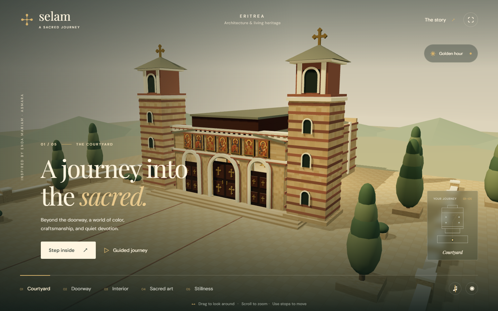
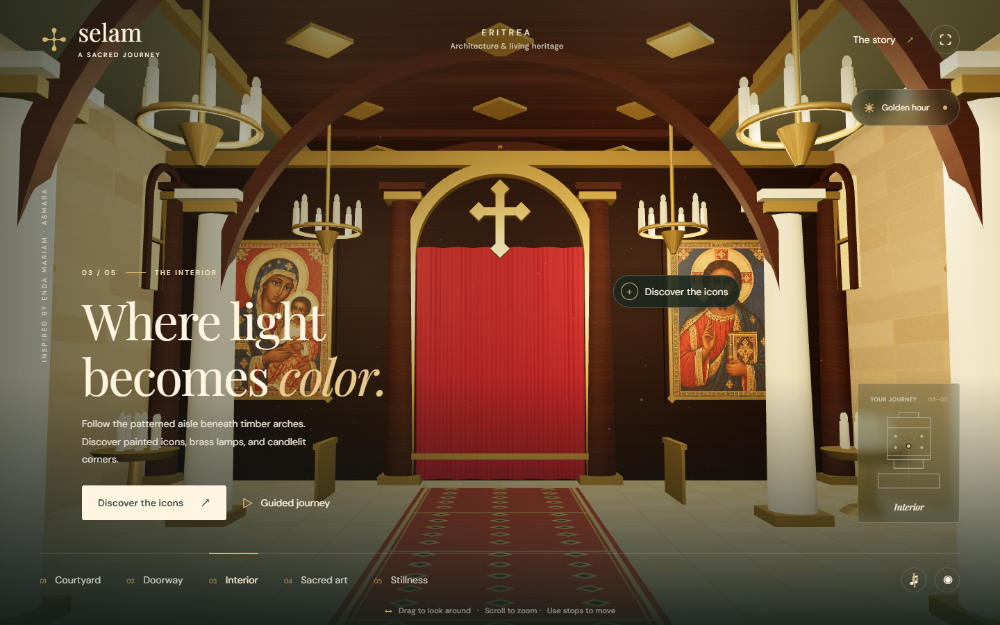

# Selam — A Sacred Journey

An interactive 3D journey through Eritrean Orthodox-inspired architecture. Walk from a sunlit courtyard into a richly decorated church, explore sacred art, and pause in candlelight.



## Explore

- Five connected viewpoints, from the courtyard to the sanctuary curtain
- A guided tour, drag-to-look controls, and keyboard navigation
- Three original icon-inspired illustrations with a close-up gallery
- Golden-hour and candlelight settings, with optional ambient sound
- Responsive layouts and a reduced-motion option



## Run locally

With [Node.js](https://nodejs.org/) installed:

```sh
node server.mjs
```

Open **http://127.0.0.1:4173**. No installation or build step is required.

**Controls:** select a numbered stop to travel, drag to look around, scroll to zoom, and press **H** to hide the interface. **← / →** changes stops. Open **The story** for references and reduced motion.

## Deploy

Import this repository into [Vercel](https://vercel.com/new). The included configuration serves `dist` as a static website, with no environment variables or build command needed.

## About the project

Built with **Three.js**, vanilla JavaScript, CSS, and Web Audio. The exterior draws inspiration from Enda Mariam in Asmara. The model and AI-generated artwork are creative interpretations, not an accurate reconstruction or an official church website.

Read the [creative brief, research, and future ideas](dist/creative-brief.md). Three.js is included under its [MIT license](dist/assets/THREE-LICENSE.txt).
